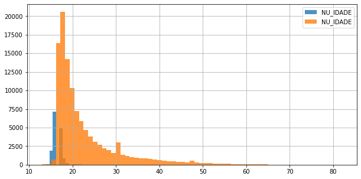
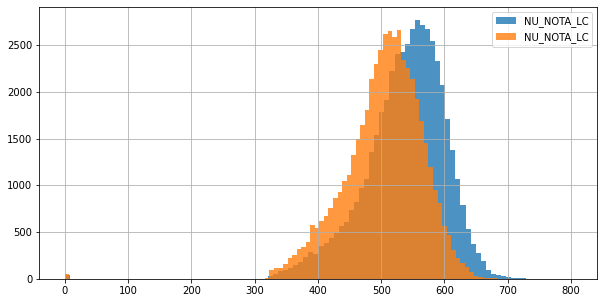

# Aula 1

## Introdução 
Como algumas atividades da universidade acabaram devorando o meu tempo do início da semana, início esta primeira aula diretamente do quarto dia. 

Além do mais, meu contato com linguagens de programação existe desde praticamente este ano (2020), e uma vez que meus conhecimentos se baseiam apenas na linguagem C, que acredito ser bastante útil para entender, de certo modo, o funcionamento da memória (apesar de que tive de pesquisar bem mais a parte para entender direito); apesar de C ser a minha base para lógica de programação, devo admitir que estou "levando um pau" nessa primeira aula haha, mesmo sempre tendo ouvido o pessoal dizer que Python seria muito fácil e C e difícil (até o momento acho a afirmação ultrajante kkk, python apresenta o peculiar habito dos meus colegas de abreviar tudo, o que dá uma bela de uma bugada na cabeça até que você decore o que signifiquem...). 

...

Aparentemente, ainda preciso dar uma revisada na estrutura sintática de Python para entender o que diabos estou fazendo. Por isso, escolhi ler a documentação hoje ao invés de terminar os desafios ou ver a próxima aula. Creio que mesmo sem o certificado no fim, ainda dá para eu continuar progredindo no meu ritmo (gosto de entender as coisas direito rs) e deixar o tal projeto aqui no GitHub.

...

Pelo visto eu não irei conseguir terminar dentro do tempo, então vou apenas fazer devagar mesmo.

Adicionalmente, eu diria que o pré-requisito para este curso seria um pouco de experiencia com python, e não apenas "lógica de programação". Como programação em C geralmente e vista em universidades, eu não estou vendo muita intersecção entre a estrutura ou logica de uso da ferramenta Colab com os programas que tive que fazer em C. 

## Recursos uteis que mandaram no Discord
Cheatsheet sobre pandas: https://pandas.pydata.org/Pandas_Cheat_Sheet.pdf

Documentação Pandas: https://pandas.pydata.org/pandas-docs/stable/user_guide/io.html
(Seção "Vizualization") 

Sobre histogramas em Python: https://data36.com/plot-histogram-python-pandas/

## Perguntas sobre os dados que surgiram durante a primeira aula
•	(Treineiro) Será que quem e treineiro tem maiores chances de aumentar a nota?

•	(Treineiro) Quem faz o Enem como treineiro tem maiores chances de aprovação (como o dado de aprovação não está presente, determinar uma média de nota mínima para aprovações seria interessante) (requereria um estudo temporal com os dados de anos anteriores para checar se a pessoa já fez antes, e se sim, quantas vezes...)

•	(Inglês e espanhol) será que os alunos que escolhem espanhol tiram mais ou menos pontos que aqueles que escolheram inglês, na prova de linguagens? 

* Ouvi sobre casos de pessoas que já que não falavam ou sabiam muito sobre nenhuma das duas línguas, escolheu espanhol na impressão de ser mais próximo da língua portuguesa. Seria isso verdade? Seria isso algo possível de ser medido com os dados disponíveis? 

**Lembrar de analisar o dicionário de dados para pensar em perguntas a se fazer. **

## Questões e comentários sobre Colab
•	Como será que o gráfico de boxplot(?) ficaria caso os dados estivessem igualmente distribuídos?

•	Para alguém que só programou em C pela primeira vez, que e considerada mais tipada e difícil, a estrutura sintática de Python (ou seja, lá o que for que esse Colab usa) está até que bem críptica

•	Talvez se na aula eles tivessem explicado melhor como as funções pudessem ser usadas, ao invés de apenas mostrar alguns exemplos. Para mim que só sei um pouco de programação e estou apenas terminando minhas aulas sobre estruturas de dados em C, e, portanto, tenho um certo conhecimento de lógica de programação, confesso estar um pouco perdido sobre como esse negócio de panda manuseia listas inteiras. Saberia como trabalhar com itens e criar loops para calcular a porcentagem, mas como isso acontece em Python?? Kkk

•	Como tive provas no início da semana, estou vendo a primeira aula já no quarto dia... será que consigo terminar?

•	A pesquisar: o que é panda e no que difere de uma linguagem (Python ou C)?

•	Fato: os relatórios de erro de Python não ajudam muito alguém ignorante como eu :/

•	Achei um Cheatsheet que mandaram no Discord: https://pandas.pydata.org/Pandas_Cheat_Sheet.pdf

## Desafios
### Desafio 1: Proporção dos inscritos por idade.
Não parece ser o meio mais eficiente para fazer isso, mas como não sei nada de python ou panda, estou satisfeito.
```python
(dados["NU_IDADE"].value_counts()/dados["NU_IDADE"].value_counts().sum()*100).sort_index()
```
```python
13     0.003140
14     0.110692
15     1.577171
16     6.146962
17    16.687078
        ...    
73     0.001570
75     0.001570
76     0.000785
77     0.000785
82     0.000785
Name: NU_IDADE, Length: 65, dtype: float64
```

### Desafio 2: Descobrir de quais estados são os inscritos com 13 anos.
Os 4 alunos de 13 anos que se inscreveram no Enem são dos estados de SP, MT, BA e AP.

```python
dados.query("NU_IDADE == 13")[["SG_UF_RESIDENCIA", "NU_IDADE"]].value_counts()  
```
```python
SG_UF_RESIDENCIA  NU_IDADE
SP                13          1
MT                13          1
BA                13          1
AP                13          1
dtype: int64
```

### Desafio 3: Adicionar título no gráfico
Aqui se faz necessária a importação de uma outra biblioteca, a **matplotlib.pyplot**. 

```python
import matplotlib.pyplot as plt

dados["SG_UF_RESIDENCIA"].hist(bins=27, figsize=(10,5), legend=1)

plt.title("Presença de estados na amostra.")

```

### Desafio 4: Plotar os Histogramas das idades dos do treineiro e não treineiros.
Usar **.query()** para buscar na lista, e ajustar **alpha** na criação do histograma para adicionar transparência.
```python
dados.query("IN_TREINEIRO==1")["NU_IDADE"].hist(alpha=0.8, bins=65)
dados.query("IN_TREINEIRO==0")["NU_IDADE"].hist(alpha=0.8, bins=65)
```
Resultado: 


### Desafio 5: Comparar as distribuições das provas em inglês espanhol


### Desafio 6: Explorar a documentações e visualizações com matplotlib ou pandas e gerar novas visualizações.
Acho que as pesquisas para os desafios são mais que suficientes :)
